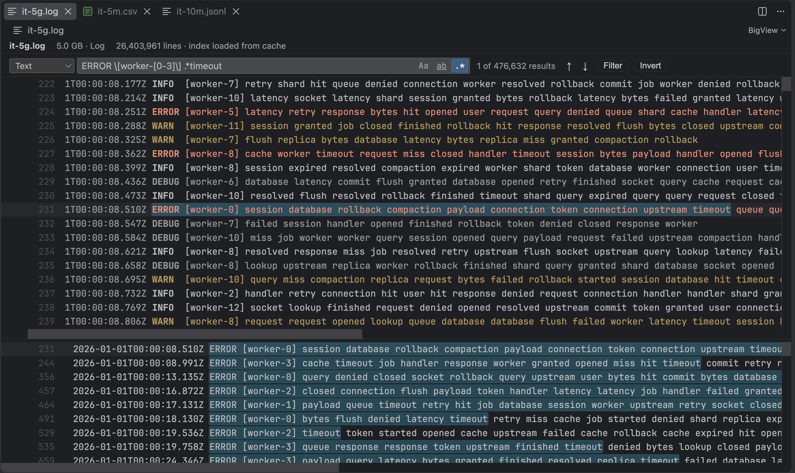
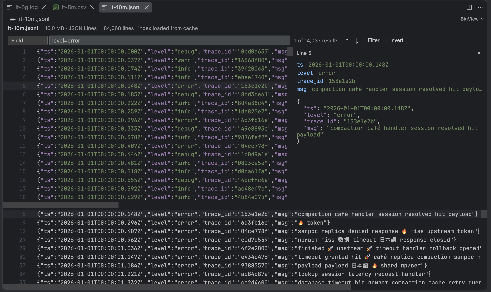
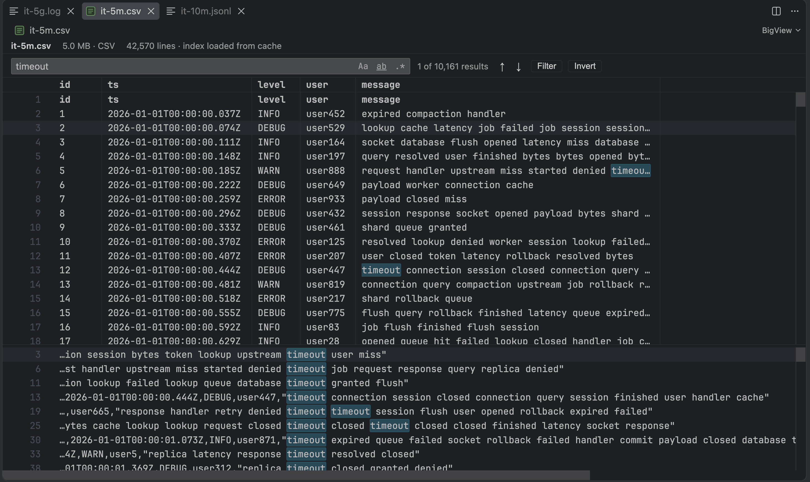

# BigView

View, search, filter and tail **huge** text files in VS Code: logs, JSON Lines and CSV/TSV, from megabytes to tens of gigabytes. BigView never loads the file into memory: it keeps a compact line index and reads only the lines on screen.



## Why

VS Code's text editor refuses or struggles with files of hundreds of megabytes. BigView opens a 5 GB log in about a second, shows the first page right away, and stays within a few hundred megabytes of memory whatever the file size.

| | 1 GB log | 5 GB log |
|---|---|---|
| First page | ~50 ms | ~50 ms |
| Full index | ~0.3 s | ~1.5 s |
| Reopen (index cached on disk) | instant | instant |
| Literal search, whole file | ~0.5 s | ~3 s |

*Measured on an Apple M-series laptop with an SSD. Your numbers depend on the disk.*

## Features

### Viewing
- Opens `.log`, `.jsonl`, `.ndjson`, `.csv` and `.tsv` files by default. Any other file: **Open File in BigView** from the Explorer or editor tab context menu.
- Scrolls smoothly through millions of lines. Very long lines are cut for display at 16 KB.
- **Go to Line** (`Ctrl+G`); the status bar shows the size, line count and indexing progress.
- Read-only: BigView never changes your file.

### Search and filter
- Searches the whole file in a background thread, with streaming results and progress: plain text, match case (`Alt+C`), whole word (`Alt+W`), regular expression (`Alt+R`).
- `F3` / `Shift+F3` (`Cmd+G` / `Shift+Cmd+G` on macOS) jump between matches; a results panel lists them all.
- **Filter**: show only the matching lines, or **Invert** to hide them.
- **Export Filtered Lines** writes the filtered lines to a new file.

### Formats
Detected from the extension and the first lines of the file; change it with **BigView: Change Format…** (or click the format in the status bar). The choice is remembered per file.

- **Log**: lines colored by level (`ERROR`, `WARN`, `INFO`, `DEBUG`, …), timestamps recognized, and a **time range** filter (`from` / `to`).
- **JSON Lines**: syntax highlighting in the colors your theme uses for JSON; select a line to see its fields and pretty-printed JSON; filter by field, e.g. `level=error`, `user.id=42`, `msg~timeout|refused`. Click a field to filter by its value.
- **CSV / TSV** (also `;` and `|`): the delimiter is detected, the first line is used as the header, and rows are shown as a table with resizable columns.





### Live files
- **Tail**: new lines appended to the file appear right away. When you are scrolled to the end, the view follows them. An active search or filter keeps up with the new lines.
- **Log rotation** (the file is renamed and recreated, or truncated in place) is detected and the file is indexed again.
- A deleted file is reported, and reloaded if it comes back.

## Keyboard shortcuts

| Action | Windows / Linux | macOS |
|---|---|---|
| Find | `Ctrl+F` | `Cmd+F` |
| Next / previous match | `F3` / `Shift+F3` | `Cmd+G` / `Shift+Cmd+G` |
| Go to Line | `Ctrl+G` | `Ctrl+G` |
| Match case / whole word / regex | `Alt+C` / `Alt+W` / `Alt+R` | `Alt+C` / `Alt+W` / `Alt+R` |
| Close search | `Escape` | `Escape` |

All commands are also in the Command Palette under **BigView**.

## Limitations

BigView is built for reading and searching. Honestly, it does **not** do the following:

- **No sorting** of lines or CSV columns. Sorting a multi-gigabyte file needs a copy of it; BigView shows the file in its own order.
- **No editing.** The file is read-only.
- **Local files only** (no remote, SSH or virtual file systems yet).
- **UTF-8 only** (plain ASCII works too). UTF-16 and other encodings are not decoded. Files containing NUL bytes in the first 4 MB are treated as binary and not opened.
- **Timestamps without a time zone are taken as UTC.** Log formats are recognized heuristically; unusual timestamp layouts may not be picked up by the time range filter.
- **CSV fields containing line breaks** (quoted multi-line values) are shown as separate lines: BigView's unit is a line.
- Search works **line by line**: a pattern cannot match across a line break.
- Lines longer than 16 KB are cut in the view (search and export still see the whole line); the JSON details panel reads up to 1 MB of a line.
- The line index is cached in VS Code's extension storage (at most 500 MB in total, entries unused for 30 days are removed). Cached indexes are rebuilt when the file changes.

## Privacy

BigView works entirely offline. It sends nothing anywhere.

## Development

```bash
npm install
npm run build          # esbuild: extension, workers, webview
npm test               # unit tests (vitest)
npm run test:integration   # VS Code integration tests (BIGVIEW_LARGE=1 / BIGVIEW_HUGE=1 for 1 GB / 5 GB files)
npm run bench          # memory and speed per phase on generated files
npx vsce package       # build the .vsix
```
